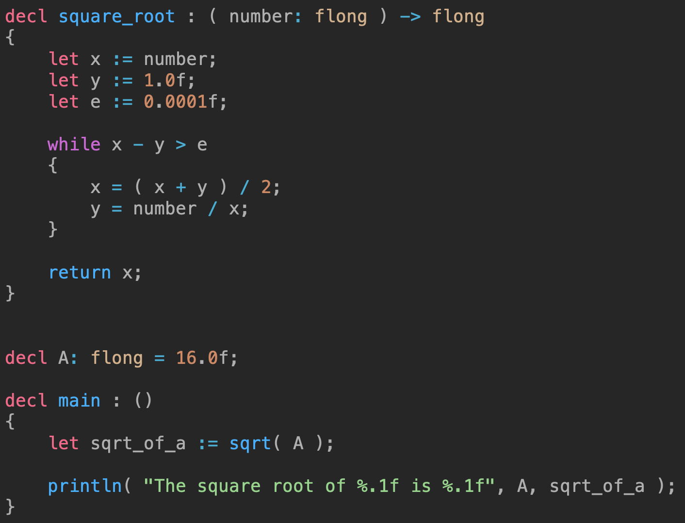

# Dragonfly
> A programming language that I'm making for fun in my freetime


## TODO:
[X] Lexing
[X] Parsing
	- Most parsing works there's just some silly bugs I need to iron out.
[ ] Bytecode generation (metaprogramming and just a custom IR)
[ ] LLVM (for platform support)
[ ] Metaprogramming
[ ] Custom backends
[ ] Cross-compilation

## An example



## The Syntax
If your're coming from the C/C++ like me some of the syntax might look a little
foreign, so let me break it down for you.

### `decl`
This is one of the foundational keywords. It's used to declare constants, types,
and procedures.

#### Constants
Constants are quite simple:
```
decl MY_CONSTANT: quad = 32;
```

The formula is simply
```
decl <name>: <type> = <value>;
```

Note that the the type is required and, naturally, the value has to be a constant
expression (string literal, number literal, etc.).

#### Types

Dragonfly has all the essentials:

##### Structs
Structs work the exact same way they do in C. All members are public,
and it's not even possible to make them private. Here's a simple example of our
struct declaration syntax:
```
decl MyStruct : struct
{
	my_string:  string;
	my_integer: ilong;
	my_double:  fquad;
}
```

As you can see, it's quite similar to C, its just that the name/type order is
backwards from what you're used to.

##### Unions & enums
unions & enums are ***UNDER DEVELOPMENT***

#### Procedures
Procudures, or functions, (They're efectively the same, but we're just going to
refer to them as procedures from here onwards) are, like many other things,
extremely simple. Here's the basic formula:
```
decl <name> : ( <name>: <type>, ... ) -> <type>
{
	// code...
}
```

Obviously you can omit the return type if you don't want to return anything, or
omit the parameters if you don't want parameters.

### `let`
This keyword is used to declare variables. And with these, we get to use the `:=`
operator. `:=` lets us implicity type a variable. For example:
```
// implicity typed as string
let my_var := "Hello!";
```

### Range expressions
Range expressions work by using something similar to interval-notation from math.<br>

For instance, if we want a range from zero to ten, with ten excluded, that would be:
```
	[0..10)
```
You could exclude both endpoints too:
```
	(0..10)
```
I'm sure you can extrapolate all the other combinainations as well. One more thing to
note however is that the range endpoints don't have to be literals. You can use
non-constant expressions to define them as well.
```
let some_end := 10;
for i in [0..some_end) { }
```

### Control flow
i got bored and stopped writing this lol
